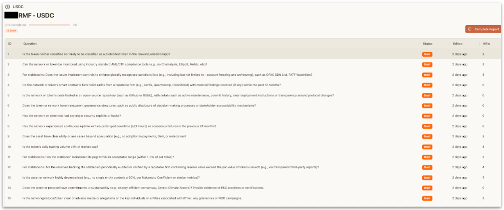
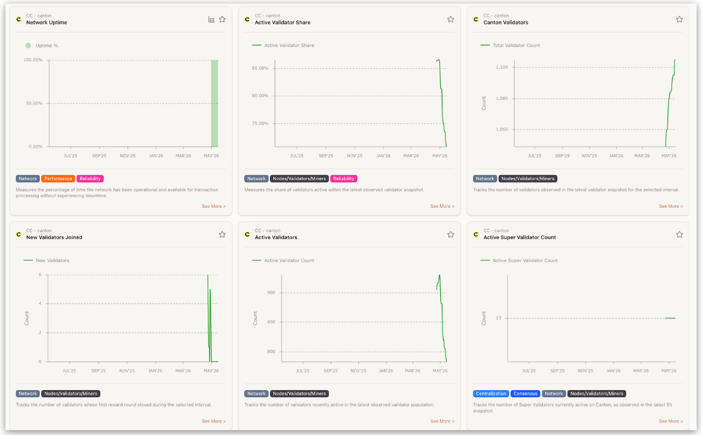
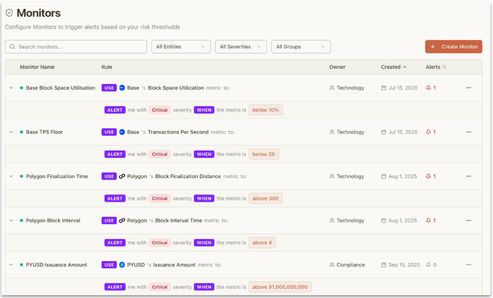

# Development Fund Proposal

**Author:** Metrika, Inc.  
**Status:** Draft  
**Created:** 2026-05-15  
**Label:** `regulatory-compliance` \
**Champion:** :Shaul Kfir

---

# Abstract

This proposal requests funding to establish a standardized operational risk operationalization framework for the Canton ecosystem through the development of a Canton-tailored implementation guide for the GBBC Risk Mitigation Framework (RMF), protocol-level Key Risk Indicators (KRIs), and continuously monitored operational oversight methodologies.

The initiative focuses on translating high-level operational risk concepts into measurable and reproducible monitoring workflows that support ecosystem transparency, Super Validator accountability, governance visibility, operational resilience, and onboarding readiness for ecosystem participants evaluating or operating on Canton-based infrastructure.

The proposal is intended to produce ecosystem-facing public goods that help establish more standardized approaches for operational risk monitoring, governance visibility, and ecosystem transparency across Canton-based infrastructure.

---

# Specification

## 1. Objective

Canton participates in the GBBC Risk Mitigation Framework (RMF) core group, which defines a structured taxonomy for digital asset infrastructure risk. However, operational risk frameworks remain difficult to apply consistently unless translated into measurable, continuously monitored operational oversight methodologies.

This proposal establishes a Canton-tailored operationalization framework that organizes protocol telemetry, governance visibility, operational resilience indicators, and monitoring workflows into a structured and reproducible operational oversight model.

As Canton adoption expands across tokenization initiatives involving regulated financial institutions and financial market infrastructure participants, ecosystem stakeholders increasingly require structured approaches for:

- onboarding assessments
- periodic operational reviews
- continuous monitoring
- operational resilience visibility
- governance-aligned control development
- Super Validator accountability and monitoring

The initiative aims to simplify operational oversight by organizing telemetry, monitoring logic, governance interpretation, and reporting into a reusable and ecosystem-aligned framework.

The proposal has a single objective:

> Establish a standardized operational risk operationalization framework for Canton-based infrastructure through measurable protocol-level monitoring methodologies and ecosystem-facing implementation guidance.

---

## 2. Implementation Mechanics

The implementation consists of four integrated components.

### A. Canton RMF Operationalization Framework

The proposal will establish a Canton-tailored operationalization methodology that maps RMF categories into measurable protocol-level monitoring constructs.

The framework will:

- Organize telemetry into structured operational risk categories
- Define governance-aligned monitoring workflows
- Establish reproducible monitoring methodologies
- Define operational resilience indicators
- Support onboarding and periodic operational assessment workflows
- Establish standardized approaches for operational oversight interpretation

### B. KRI Engineering & Monitoring Methodology

The proposal establishes protocol-level KRIs and monitoring methodologies rather than simple dashboards or analytics.

Representative monitoring domains include:

- Super Validator accountability and concentration visibility
- Governance cadence and upgrade activity
- Synchronizer liveness and operational continuity
- Infrastructure concentration and dependency exposure
- Economic sustainability indicators
- Operational resilience monitoring

Each monitoring methodology will include:

- Explicit definitions
- Data dependencies
- Threshold logic
- Severity classification methodologies
- Monitoring interpretation guidance

### C. Operational Monitoring Framework

The proposal will establish continuously monitored operational oversight workflows that:

- Continuously evaluate protocol-level indicators
- Apply calibrated threshold methodologies
- Support severity classification
- Maintain monitoring history visibility
- Support exportable reporting views
- Support monitoring, compliance, and third-party audit capabilities

The implementation focuses exclusively on protocol-layer telemetry and does not modify Canton protocol logic, governance, or validator operations.

### D. Ecosystem-Facing Guidance & Walkthroughs

The proposal will produce ecosystem-facing implementation guidance and walkthrough materials demonstrating how operational oversight methodologies can be applied to Canton-based infrastructure.

Deliverables include:

- Public operationalization guidance
- Public walkthrough materials
- Governance-aligned monitoring examples
- Reporting workflow examples
- Reference operational oversight methodologies

---

## 3. Architectural Alignment

This proposal aligns with multiple Canton ecosystem priorities.

### Stability and Maintainability

- Super Validator accountability and monitoring
- Structured operational oversight workflows
- Governance visibility and telemetry standardization
- Operational simplicity through structured monitoring and reporting

### Security and Resilience

- Continuous operational monitoring
- Synchronizer liveness visibility
- Operational resilience monitoring
- Monitoring and third-party audit support capabilities
- Infrastructure concentration visibility

### Regulatory Compliance

- Governance-aligned operational oversight methodologies
- Standardized onboarding and periodic review workflows
- Structured operational risk visibility
- Exportable monitoring and reporting methodologies

The proposal:

- Does not modify Canton protocol logic
- Does not alter validator operations
- Does not modify governance structures
- Preserves Canton’s privacy segmentation model
- Operates as an external operational oversight layer atop existing telemetry surfaces

The initiative aligns with Canton’s positioning as Financial Market Infrastructure-grade blockchain infrastructure.

---

## 4. Backward Compatibility

No backward compatibility impact.

---

# Milestones and Deliverables

## Milestone 1: RMF Operationalization Framework

- **Estimated Delivery:** Month 2
- **Focus:** Establish Canton-tailored operational oversight framework and monitoring methodologies
- **Deliverables / Value Metrics:**
  - RMF categories mapped into reproducible operational monitoring methodologies
  - Standardized KRI definitions and monitoring logic established
  - Governance-aligned operational oversight workflows documented
  - Reusable operational assessment methodologies established

## Milestone 2: Operational Monitoring Framework

- **Estimated Delivery:** Month 4
- **Focus:** Establish continuously monitored operational oversight workflows
- **Deliverables / Value Metrics:**
  - Monitoring visibility for operational resilience indicators established
  - Severity classification methodologies operationalized
  - Monitoring history and reporting visibility demonstrated
  - Third-party audit and operational review support capabilities demonstrated

## Milestone 3: Ecosystem Enablement & Public Guidance

- **Estimated Delivery:** Month 6
- **Focus:** Publish ecosystem-facing operationalization guidance and walkthrough materials
- **Deliverables / Value Metrics:**
  - Public operationalization guidance released
  - Public walkthrough materials published
  - Governance-aligned monitoring workflows demonstrated
  - Ecosystem participants able to reference reusable operational oversight methodologies

---

# Acceptance Criteria

The Tech & Ops Committee will evaluate completion based on:

- Demonstrated operationalization of RMF categories for Canton-based infrastructure
- Public availability of ecosystem-facing operationalization guidance
- Demonstrated reproducibility of monitoring methodologies
- Demonstrated support for onboarding and periodic operational assessment workflows
- Demonstrated monitoring visibility for protocol-level operational resilience indicators
- Ecosystem accessibility of walkthrough and methodology materials
- Alignment with ecosystem operational resilience and governance visibility goals

Additional project-specific conditions:

- Monitoring methodologies must be transparent and reproducible
- Monitoring history visibility must be demonstrated
- Governance-aligned operational oversight workflows must be documented

---

# Funding

**Total Funding Request:** USD equivalent of $250,000 in Canton Coin

## Payment Breakdown by Milestone

- **Milestone 1 (RMF Operationalization Framework):** 40% upon committee acceptance
- **Milestone 2 (Operational Monitoring Framework):** 40% upon committee acceptance
- **Milestone 3 (Ecosystem Enablement & Public Guidance):** 20% upon final release and acceptance

## Volatility Stipulation

Should the project timeline extend beyond 6 months due to Committee-requested scope changes, any remaining milestones must be renegotiated to account for significant USD/CC price volatility.

---

# Co-Marketing

Upon release, the implementing entity will collaborate with the Foundation on:

- Announcement coordination
- Technical architecture or operationalization blog post
- Ecosystem walkthrough session
- Operational resilience and governance visibility educational content

---

# Motivation

Canton aims to function as Financial Market Infrastructure-grade blockchain infrastructure.

As ecosystem adoption expands across tokenization initiatives and institutional onboarding efforts, ecosystem participants increasingly require structured approaches for:

- onboarding operational assessments
- periodic operational reviews
- governance visibility
- operational resilience monitoring
- Super Validator accountability
- continuously monitored operational oversight

The initiative helps establish more standardized approaches for operational risk monitoring, governance visibility, and ecosystem transparency across Canton-based infrastructure.

The proposal is expected to benefit a broad portion of the Canton ecosystem, including:

- validator operators
- governance participants
- tokenization initiatives
- regulated financial institutions evaluating onboarding onto Canton-based infrastructure
- ecosystem participants requiring operational resilience visibility and governance-aligned monitoring

The resulting framework is intended to serve as ecosystem-facing operational infrastructure rather than application-specific tooling.

---

# Rationale

The proposal focuses on extending existing Canton telemetry and governance visibility capabilities through standardized operational oversight methodologies rather than introducing protocol modifications or governance changes.

This approach:

- Leverages existing telemetry surfaces
- Preserves Canton’s privacy architecture
- Avoids governance-sensitive composite scoring
- Organizes monitoring methodologies into reusable operational workflows
- Supports monitoring, compliance, and auditability use cases
- Establishes reusable ecosystem-facing operational oversight methodologies

The proposal is designed to complement existing Canton ecosystem tooling and infrastructure by providing a standardized operational risk operationalization layer rather than replacing existing systems or introducing competing infrastructure.

The default architectural approach is therefore to extend and organize existing telemetry and operational visibility capabilities into a reusable ecosystem framework.

